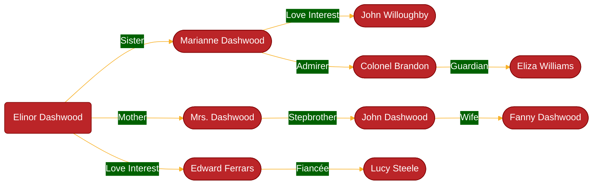

# Austen

Austen is an AI-powered Nextjs application to generate story relationships between book characters using Mermaidjs diagrams.

## Features

- 📚 Search and analyze any book from Open Library
- 🤖 AI-powered character relationship analysis
- 📊 Generate Mermaid diagrams
- 💾 Save, download (SVG, PNG) and manage your generated graphs
- 🌐 Share graphs publicly or keep them private
- 🔍 Discover public graphs generated by other users
- 👤 User accounts

## Example Graph

A character relationship graph generated for "Sense and Sensibility" by Jane Austen:



## Stacks:

- [Nextjs](https://nextjs.org)
- [React](https://react.dev)
- [TypeScript](https://www.typescriptlang.org)
- [Supabase](https://supabase.com)

## UI

- [Tailwindcss](https://tailwindcss.com/)
- [Shadcn/ui](https://ui.shadcn.com/)
- [Mermaid](https://mermaid.js.org)

## API

- [Open Library](https://openlibrary.org)
- [DeepSeek](https://deepseek.com)
- [OpenAI](https://platform.openai.com/docs/quickstart)
- [Brave Search API](https://brave.com/search/api/)

## Installation & Setup

1. Clone the repository:

   ```bash
   git clone https://github.com/herol3oy/austen.git
   cd austen
   ```

2. Install dependencies:

   ```bash
   npm i
   ```

3. Set up environment variables:

   - Copy `.env.local.example` to `.env.local`
   - Fill in the required API keys:
     ```env
     DEEPSEEK_API_KEY=your_deepseek_api_key
     NEXT_PUBLIC_SUPABASE_URL=your_supabase_url
     NEXT_PUBLIC_SUPABASE_ANON_KEY=your_supabase_anon_key
     ```

4. Set up Supabase:

   - Create a new Supabase project
   - Enable authentication
   - Run the following SQL statements in your Supabase SQL editor to create the `graphs` and `profiles` tables:

     ```sql
     create table public.graphs (
       id uuid not null,
       book_name text not null,
       svg_graph text not null,
       mermaid_syntax text not null,
       created_at timestamp with time zone not null default now(),
       author_name text null,
       emojis text null,
       user_id uuid null,
       is_public boolean null default false,
       constraint graphs_pkey primary key (id),
       constraint graphs_user_id_fkey foreign KEY (user_id) references auth.users (id)
     ) TABLESPACE pg_default;

     create table public.profiles (
       id uuid not null,
       username text not null,
       updated_at timestamp with time zone null default now(),
       constraint profiles_pkey primary key (id),
       constraint profiles_username_key unique (username),
       constraint profiles_id_fkey foreign KEY (id) references auth.users (id) on delete CASCADE,
       constraint username_format check ((username ~ '^[a-zA-Z0-9_]+$'::text)),
       constraint username_length check (
         (
           (char_length(username) >= 3)
           and (char_length(username) <= 20)
         )
       )
     ) TABLESPACE pg_default;
     ```

   - Set up Row Level Security (RLS) for both tables (see Supabase dashboard for examples on restricting access based on `user_id` or `is_public` status).
   - Create a Supabase database function `handle_new_user` and a trigger on `auth.users` to automatically create a profile entry when a new user signs up. The function should extract the username from `NEW.raw_user_meta_data ->> 'username'`.

     ```sql
     -- Function to create a profile for a new user
     create function public.handle_new_user()
     returns trigger
     language plpgsql
     security definer set search_path = public
     as $$
     begin
       insert into public.profiles (id, username)
       values (new.id, new.raw_user_meta_data->>'username');
       return new;
     end;
     $$

     -- Trigger to call the function after a new user is created
     create trigger on_auth_user_created
       after insert on auth.users
       for each row execute procedure public.handle_new_user();
     ```

5. Start the development server:

   ```bash
   npm run dev
   ```

6. Build for production:
   ```bash
   npm run build
   ```

## TODO

- [ ] Implement Like/Unlike Functionality for Graphs

  - [ ] Add like button
  - [ ] Implement like/unlike API endpoints in Supabase
  - [ ] Add like count display

- [ ] Load more graphs in the discover page
  - [ ] Add a button to load more graphs

## Screenshot

## Jane Austen logo reference

"Jane Austen Inspired Illustrations", CC-BY 4.0. Quelle:
https://colorconfetti.com/culture-history-environment/jane-austen/jane-austen-inspired-illustrations/

## License

[MIT LICENSE](LICENSE)
